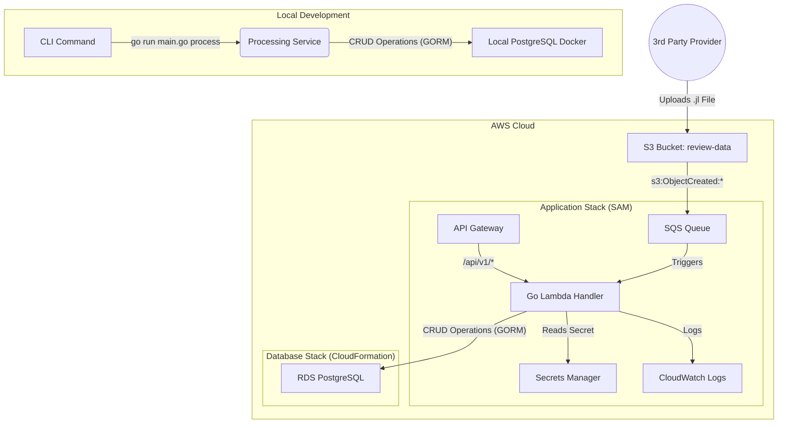

# Review System Microservice

This project is a scalable, event-driven microservice for processing and managing hotel review data. Built with Go and a serverless AWS architecture, it provides a robust foundation for handling data ingestion and a full CRUD API for data management.

## Table of Contents

- [Architecture](#architecture)
- [Features](#features)
- [Getting Started](#getting-started)
- [Local Development](#local-development-and-testing)
- [API Documentation](#api-documentation)
- [Deployment Strategy](#deployment-strategy)

## Architecture

The microservice follows the principles of Clean Architecture, ensuring a clear separation of concerns between the API handlers, business logic (services), and data access (repositories).



## Features

- **Serverless & Event-Driven**: Built with AWS Lambda and triggered by S3/SQS for scalability and efficiency.
- **Full CRUD API**: Provides a complete RESTful API for managing providers, hotels, and reviews.
- **Clean Architecture**: Promotes maintainability, testability, and separation of concerns.
- **Secure by Design**: Utilizes AWS Secrets Manager for database credentials.
- **Infrastructure as Code**: AWS resources are managed with AWS SAM and CloudFormation.
- **Safe Deployments**: Implements a blue-green deployment strategy with automated rollbacks.
- **Dockerized**: Includes a `Dockerfile` and `docker-compose.yml` for a consistent local development environment.
- **API Documentation**: Automatically generated API documentation using Swagger.

## Getting Started

### Prerequisites

- Go 1.21+
- Docker and Docker Compose
- AWS SAM CLI
- AWS CLI (configured with your credentials)

## Local Development and Testing

This guide explains how to set up and run the application locally.

### 1. Environment Setup

- **Create a `.env` file**:
  ```bash
  cp .env.example .env
  ```
  The default values are pre-configured for the local Docker Compose setup.

### 3. Testing the Application

- **Run the API Server**:
  -   Ensure `RUN_MODE=local` is in your `.env` file.
  -   Run the command: `go run cmd/server/main.go`
  -   The API is available at `http://localhost:8080`.

- **Test the Data Processing Pipeline (SQS/S3)**:
  Use the AWS SAM CLI to invoke the function locally with a sample S3 event.
  1.  **Build the function**: `sam build`
  2.  **Invoke the function**:
      ```bash
      sam local invoke ReviewImporterFunction \
        --event test/data/events/event.json \
        --env-vars env.json
      ```

## API Documentation

- **Generate the documentation**:
  ```bash
  go run -mod=mod github.com/swaggo/swag/cmd/swag init --generalInfo cmd/server/main.go
  ```
- **View the documentation**:
  With the local server running, go to `http://localhost:8080/swagger/index.html`.

## Deployment Strategy

This project uses a **two-stack approach** to protect the database and a **blue-green deployment** strategy for safe, zero-downtime updates to the application.

### Step 1: Deploy the Database Stack (Once)

This CloudFormation stack provisions the RDS database and stores its credentials in AWS Secrets Manager.

- **Deploy the stack**:
  ```bash
  aws cloudformation deploy \
    --template-file deploy/database.yaml \
    --stack-name review-system-database \
    --parameter-overrides DBPassword=<YourSecurePasswordHere> \
    --capabilities CAPABILITY_IAM
  ```
  **Note**: You must replace the placeholder VPC and Subnet IDs in `database.yaml` with your own.

- **Get the Secret ARN**:
  Retrieve the `DBSecretArn` from the stack's "Outputs" tab or via the AWS CLI.

### Step 2: Deploy the Application Stack (Blue-Green)

This SAM stack deploys the Lambda function, API Gateway, and other application resources. The `DeploymentPreference` setting in the SAM template enables a **blue-green deployment** strategy.

- **How it works**:
  1.  AWS CodeDeploy provisions a new version of your Lambda function.
  2.  It shifts a small percentage of traffic (10% every minute) to the new version.
  3.  It monitors the `ApiGateway5XXErrorAlarm` CloudWatch alarm. If the alarm is triggered during the deployment, CodeDeploy automatically rolls back to the previous version.

- **Deployment Command**:
  ```bash
  sam build --template-file deploy/sam/template.yaml && \
  sam deploy \
    --guided \
    --stack-name review-system-app \
    --parameter-overrides DBSecretArn=<Your-DB-Secret-ARN-Here> \
    --capabilities CAPABILITY_IAM
```