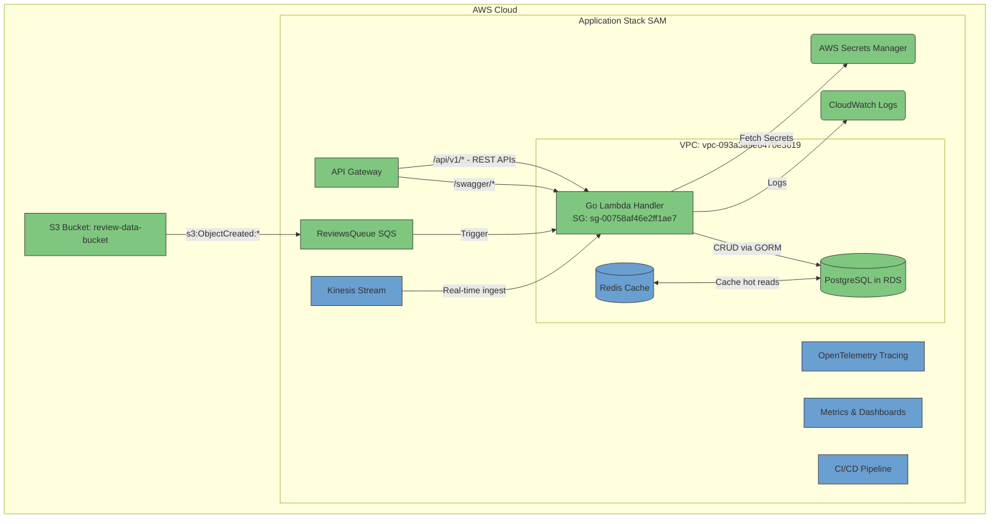
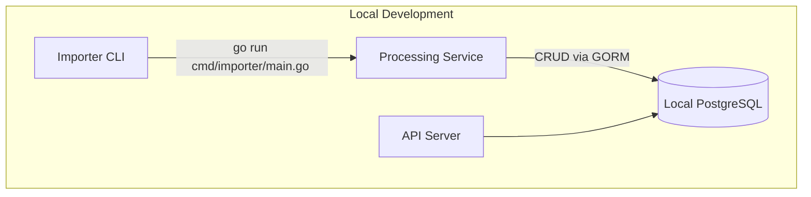

**Review System Microservice**

A scalable, event-driven microservice for ingesting, processing, and managing hotel review data. Built in Go with a serverless AWS architecture, this service offers a robust foundation for data ingestion pipelines and a full CRUD REST API.

---

## Table of Contents

1. [Tech Stack](#tech-stack)
2. [Architecture Overview](#architecture-overview)
3. [Features](#features)
4. [Prerequisites](#prerequisites)
5. [Installation & Configuration](#installation--configuration)
6. [Local Development](#local-development)
7. [Usage Examples](#usage-examples)
8. [API Reference](#api-reference)
9. [Testing](#testing)
10. [Deployment](#deployment)
11. [Contributing](#contributing)
12. [License](#license)

---

## Tech Stack

* **Language:** Go 1.23+

* **Frameworks & Libraries:**

  * AWS Lambda Go SDK (`github.com/aws/aws-lambda-go`)
  * AWS SDK v2 (`github.com/aws/aws-sdk-go-v2`)
  * GORM (`gorm.io/gorm`, `gorm.io/driver/postgres`)
  * Gorilla Mux (`github.com/gorilla/mux`)
  * Viper & Dotenv (`github.com/spf13/viper`, `github.com/joho/godotenv`)
  * ZeroLog (`github.com/rs/zerolog`)
  * Swagger (`github.com/swaggo/swag`, `github.com/swaggo/http-swagger`)

* **Infrastructure:** AWS SAM, CloudFormation, S3, SQS, Secrets Manager, RDS (PostgreSQL), API Gateway, CloudWatch

* **Local Dev:** Docker, Docker Compose, PostgreSQL


## Architecture Overview

This service follows **Clean Architecture** principles, separating core business logic from external dependencies.

Green: Components that are already implemented
Blue: Componenets that are yet to be implemented

Production setup:


Local Development:


---

## Features

* **Event-Driven:** Ingest reviews via S3 → SQS → Lambda pipeline.
* **Full CRUD API:** Manage providers, hotels, and reviews through REST endpoints.
* **Clean Architecture:** Ensures maintainable, testable code.
* **Secure:** Database credentials stored in AWS Secrets Manager.
* **IaC:** Resources defined with SAM & CloudFormation.
* **CI/CD**: CI/CD using Github Actions
* **Zero-Downtime Deployments:** Blue-green releases with automated rollback.
* **Local Development:** Dockerized PostgreSQL & easy setup.
* **Auto-Generated Docs:** Swagger UI for API exploration.

---

## Prerequisites

* Go 1.23+ installed
* Docker & Docker Compose
* AWS CLI & AWS SAM CLI
* AWS credentials configured (`~/.aws/credentials`)

---

## Installation & Configuration

1. **Clone the repo**

   ```bash
   git clone https://github.com/kirananto/review-system.git
   cd review-system
   ```

2. **Environment Variables**

   * Copy example and update as needed:

     ```bash
     cp .env.example .env
     ```
   * For local dev, default `.env` targets Docker Compose PostgreSQL.

3. **Docker Setup (Local DB)**

   ```bash
   docker-compose up -d postgres
   ```

---

## Local Development

### Run Importer CLI

```bash
go run cmd/importer/main.go /path/to/reviews.jl
```

### Start API Server

```bash
# Ensure RUN_MODE=local in .env
go run cmd/server/main.go
```

* Server listens on `http://localhost:8000`

### Invoke Lambda Locally (SAM)

```bash
sam build
sam local invoke ReviewImporterFunction \
  --event test/data/events/event.json \
  --env-vars env.json
```

---

## Usage Examples

### Import Reviews

```bash
# Process a local file
go run cmd/importer/main.go test/data/reviews.jl
```

### CRUD via cURL

```bash
# Create a Provider
curl -X POST http://localhost:8000/api/v1/providers \
  -H "Content-Type: application/json" \
  -d '{"name":"Agoda"}'

# Get Reviews
curl http://localhost:8000/api/v1/reviews
```

---

## API Reference

### Swagger UI

* Generate docs:

  ```bash
  go run -mod=mod github.com/swaggo/swag/cmd/swag init --generalInfo cmd/server/main.go
  ```
* View docs at `http://localhost:8000/swagger/index.html`

### Key Endpoints

| Resource     | Method | Path                   | Description          |
| ------------ | ------ | ---------------------- | -------------------- |
| Health Check | GET    | `/api/v1/health`       | Server health status |
| Providers    | POST   | `/api/v1/providers`    | Create a provider    |
|              | GET    | `/api/v1/providers`    | List providers       |
| Hotels       | GET    | `/api/v1/hotels`       | Read hotel list      |
|              | POST   | `/api/v1/hotels`       | Create a hotel       |
|              | PUT    | `/api/v1/hotels/{id}`  | Update a hotel       |
| Provider Hotel| GET    | `/api/v1/provider-hotels`  | Get list of associations between Provider & Hotel       |
| Reviews      | GET    | `/api/v1/reviews`      | List reviews         |
|              | GET    | `/api/v1/reviews/{id}` | Get review by ID     |

---

## Testing

* **Unit Tests**

  ```bash
   go test -v -cover -coverprofile=coverage.out ./...
  ```
* **Integration Tests**

  * Use Docker Compose for DB.

---

## Deployment

### 1. Database Stack (One-Time)

```bash
aws cloudformation deploy \
  --template-file deploy/database.yaml \
  --stack-name review-system-database \
  --parameter-overrides DBPassword=YOUR_DB_PASSWORD \
  --capabilities CAPABILITY_IAM
```

* **Retrieve** `DBSecretArn` from stack outputs.

### 2. Application Stack (Blue-Green)

```bash
sam build --template-file deploy/sam/template.yaml
sam deploy --guided \
  --stack-name review-system-app \
  --parameter-overrides DBSecretArn=YOUR_DB_SECRET_ARN \
  --capabilities CAPABILITY_IAM
```

* **Traffic shifting**: 10% per minute
* **Rollback**: Triggered on `ApiGateway5XXErrorAlarm`

---

